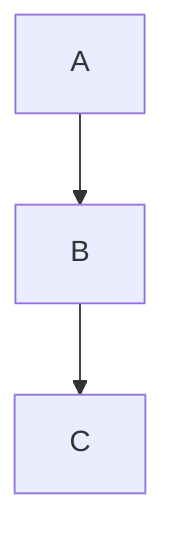
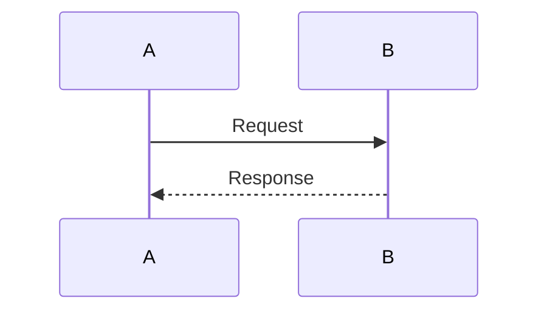

# md-to-pdf

> Markdown → PDF via headless Chrome. Syntax highlighting, Mermaid diagrams, callout boxes, auto TOC, footnotes, custom fonts, page numbers, headers/footers, watch mode, programmatic API.

## Features

- **Mermaid diagrams** — fenced ` ```mermaid ``` ` blocks render as diagrams; `height=` attribute caps diagram height
- **Callout boxes** — blockquotes render as styled info boxes; `⚠`, `warning`, `caution`, `danger`, `attention` keywords trigger orange warning style
- **Auto Table of Contents** — generated automatically at ≥ 4 `##`/`###` headings; controllable via `--toc` / `--no-toc`
- **Footnotes** — `[^1]` syntax with backlinks, collected at the bottom of the document
- **Custom body font** — `--font-family`; supports Google Fonts via `@import` prefix
- **Custom code font** — `--code-font-family`; overrides monospace font for code blocks independently
- **Page numbers** — `--page-numbers` injects a default "Page N of M" footer without manual template HTML
- **Syntax highlighting** — code blocks highlighted via highlight.js (default: `github` theme)
- **Headers & footers** — via Puppeteer's `headerTemplate`/`footerTemplate` pdf options
- **Page breaks** — `<div class="page-break"></div>`
- **Watch mode** — re-render on file change
- **Programmatic API** — use as a Node.js library
- **stdio support** — pipe markdown in, pipe PDF out
- **Front-matter config** — per-file options via YAML front-matter
- **Config file** — shared config via `.json` or `.js`

## Requirements

| Tool | Version | For |
|---|---|---|
| Node.js / Bun | 18+ | running the engine |
| Internet access | — | Mermaid diagrams (CDN) |

## Install

```sh
bun i -g md-to-pdf
```

Or clone for local development:

```sh
git clone https://github.com/simonhaenisch/md-to-pdf
cd md-to-pdf
bun install
bun link
```

## Usage

```sh
md-to-pdf path/to/file.md
```

Output is written next to the source file as `file.pdf`.

### Batch conversion

```sh
md-to-pdf ./**/*.md
```

### Pipe from stdin

```sh
cat file.md | md-to-pdf > output.pdf
cat file1.md file2.md | md-to-pdf > combined.pdf
```

### Custom output path

Set via `--dest` flag or front-matter `dest:`.

### Watch mode

```sh
md-to-pdf file.md --watch
```

Uses [Chokidar](https://github.com/paulmillr/chokidar). If editor plugins trigger extra saves after your initial save, use `awaitWriteFinish`:

```sh
md-to-pdf file.md --watch --watch-options '{ "awaitWriteFinish": true }'
```

## CLI Options

```
-h, --help               Output usage information
-v, --version            Output version
-w, --watch              Watch the current file(s) for changes
--watch-options          Options for Chokidar's watch call (JSON)
--basedir                Base directory served by the file server
--stylesheet             Path to a local or remote stylesheet (repeatable)
--css                    Inline CSS string
--document-title         Name of the HTML document
--body-class             Classes added to <body> (repeatable)
--page-media-type        Media type to emulate (default: screen)
--highlight-style        highlight.js theme (default: github)
--font-family            CSS font-family for body text
--code-font-family       CSS font-family for code blocks
--toc                    Force Table of Contents generation
--no-toc                 Suppress Table of Contents generation
--page-numbers           Add "Page N of M" footer to every page
--marked-options         Options for Marked (JSON)
--pdf-options            Options for Puppeteer PDF (JSON)
--launch-options         Puppeteer launch options (JSON)
--gray-matter-options    Options for gray-matter (JSON)
--port                   Port for the local file server
--md-file-encoding       Markdown file encoding (default: utf-8)
--stylesheet-encoding    Stylesheet encoding (default: utf-8)
--as-html                Output HTML instead of PDF
--config-file            Path to a JSON or JS config file
--devtools               Open browser with devtools (dev only)
```

## Markdown Features

### Mermaid diagrams

````markdown

````

Add a `height=` attribute to cap diagram height (prevents overflow across pages):

````markdown

````

Accepted units: `mm`, `cm`, `px`, or `%` of usable page height. Requires internet access at render time.

### Callout boxes

Every blockquote renders as a styled callout box.

```markdown
> This is an informational callout.

> ⚠ This is a warning callout (orange style).

> Caution: also triggers warning style.
```

Warning keywords: `⚠`, `warning`, `caution`, `danger`, `attention` (case-insensitive).

### Auto Table of Contents

When the document has 4 or more `##`/`###` headings, a TOC is automatically inserted before the body. Heading anchors are injected automatically.

Override auto-detection:

```sh
md-to-pdf file.md --toc       # force TOC regardless of heading count
md-to-pdf file.md --no-toc    # suppress TOC always
```

Or via front-matter: `toc: true` / `toc: false`.

### Footnotes

```markdown
This sentence has a footnote.[^1]

[^1]: Footnote text with a backlink.
```

### Page numbers

```sh
md-to-pdf file.md --page-numbers
```

Injects a centered "Page N of M" footer on every page. Ignored if `footerTemplate` is already set in `pdf_options`.

Via front-matter: `page_numbers: true`.

### Page breaks

```html
<div class="page-break"></div>
```

### Headers and footers

Via front-matter `pdf_options`:

```yaml
---
pdf_options:
  format: A4
  margin: 25mm 20mm
  printBackground: true
  headerTemplate: |-
    <style>section { font-family: system-ui; font-size: 10px; margin: 0 auto; }</style>
    <section><span class="title"></span> — <span class="date"></span></section>
  footerTemplate: |-
    <section>Page <span class="pageNumber"></span> of <span class="totalPages"></span></section>
---
```

Note: font-size in header/footer templates defaults to 1pt — always set it explicitly.

## Configuration

Options can be set (in increasing priority order): defaults → config file → front-matter → CLI flags.

Front-matter uses underscores instead of hyphens. Example:

```yaml
---
dest: ./output/report.pdf
stylesheet:
  - path/to/custom.css
body_class: markdown-body
highlight_style: monokai
font_family: "Georgia, serif"
code_font_family: "JetBrains Mono, monospace"
toc: true
page_numbers: true
pdf_options:
  format: A4
  margin: 20mm
  printBackground: true
---
```

Config file (`--config-file path/to/config.js`):

```js
module.exports = {
  stylesheet: ['path/to/style.css'],
  font_family: 'Georgia, serif',
  code_font_family: 'JetBrains Mono, monospace',
  highlight_style: 'monokai',
  page_numbers: true,
  pdf_options: {
    format: 'A4',
    margin: '20mm',
    printBackground: true,
  },
};
```

### Font family

Override the default `system-ui` font stack:

```sh
# System font
md-to-pdf file.md --font-family "Georgia, serif"

# Google Font (prefix with @import)
md-to-pdf file.md --font-family "@import url('https://fonts.googleapis.com/css2?family=Inter'); Inter, sans-serif"
```

Override the default `monospace` font for code blocks:

```sh
md-to-pdf file.md --code-font-family "JetBrains Mono, monospace"

# Google Font
md-to-pdf file.md --code-font-family "@import url('https://fonts.googleapis.com/css2?family=JetBrains+Mono'); JetBrains Mono, monospace"
```

In front-matter:

```yaml
---
font_family: "@import url('https://fonts.googleapis.com/css2?family=Inter'); Inter, sans-serif"
code_font_family: "JetBrains Mono, monospace"
---
```

### Options reference

| Option | Example |
|---|---|
| `--basedir` | `path/to/folder` |
| `--stylesheet` | `path/to/style.css`, `https://example.org/style.css` |
| `--css` | `body { color: tomato; }` |
| `--document-title` | `My Document` |
| `--body-class` | `markdown-body` |
| `--page-media-type` | `print` |
| `--highlight-style` | `monokai`, `solarized-light` |
| `--font-family` | `Georgia, serif` |
| `--code-font-family` | `JetBrains Mono, monospace` |
| `--toc` | _(flag, no value)_ |
| `--no-toc` | _(flag, no value)_ |
| `--page-numbers` | _(flag, no value)_ |
| `--marked-options` | `'{ "gfm": false }'` |
| `--pdf-options` | `'{ "format": "Letter", "margin": "20mm", "printBackground": true }'` |
| `--launch-options` | `'{ "args": ["--no-sandbox"] }'` |
| `--port` | `3000` |
| `--md-file-encoding` | `utf-8`, `windows1252` |
| `--stylesheet-encoding` | `utf-8`, `windows1252` |
| `--config-file` | `path/to/config.json` |

**`margin`** accepts CSS shorthand: `20mm` (all), `20mm 15mm` (top/bottom left/right), `10mm 20mm 30mm` (top left/right bottom), or `10mm 20mm 30mm 15mm` (top right bottom left).

## Programmatic API

```js
const fs = require('fs');
const { mdToPdf } = require('md-to-pdf');

// From file path
const pdf = await mdToPdf({ path: 'file.md' });
if (pdf) fs.writeFileSync(pdf.filename, pdf.content);

// From string, with output path
await mdToPdf({ content: '# Hello, World' }, { dest: 'output.pdf' });
```

## Merging multiple files

Use `qpdf` (or `ghostscript`) to merge separately converted PDFs:

```sh
md-to-pdf chapter1.md
md-to-pdf chapter2.md
qpdf --empty --pages chapter1.pdf chapter2.pdf -- manual.pdf
```

## Security

**Local file server:** The tool starts an HTTP server on localhost for the duration of the conversion. It serves the current working directory (or `--basedir`). The server is accessible on your local network while running — avoid running in watch mode from sensitive directories.

**Untrusted markdown:** Sanitize user-provided content before passing it to `md-to-pdf`. Markdown can contain arbitrary HTML.

## Development

```sh
git clone https://github.com/simonhaenisch/md-to-pdf
cd md-to-pdf
bun install
bun start   # tsc in watch mode
bun link    # make md-to-pdf globally available
```

References:
- [Marked options](https://marked.js.org/using_advanced)
- [Puppeteer PDF options](https://pptr.dev/api/puppeteer.pdfoptions)
- [Puppeteer launch options](https://pptr.dev/next/api/puppeteer.launchoptions)
- [highlight.js themes](https://github.com/highlightjs/highlight.js/tree/main/src/styles)

## License

[MIT](license) — © Simon Hänisch
