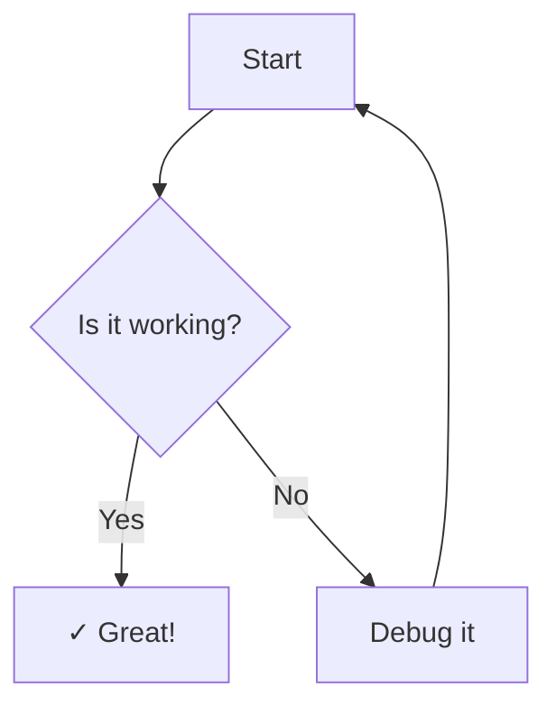
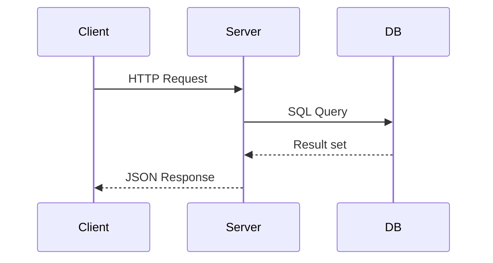
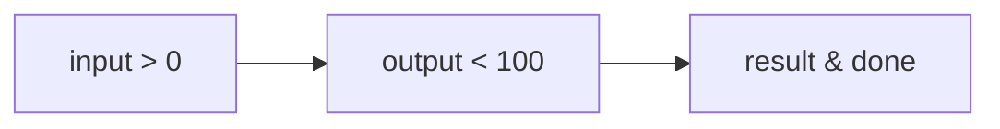

# Feature Test Document

This document exercises all features of md-to-pdf via front-matter configuration.
Active front-matter: `toc: true`, `page_numbers: true`, `font_family: Georgia`, `code_font_family: Courier New`.

## Callout Boxes

### Regular callout

> **Note:** This is a standard informational callout. Blue left border, light blue background.

### Warning callouts

> ⚠ **Warning:** Triggered by the ⚠ symbol. Orange style.

> **Caution:** Triggered by the word "Caution". Orange style.

> **Danger:** Triggered by the word "Danger". Orange style.

> **Attention:** Triggered by the word "Attention". Orange style.

## Footnotes

This paragraph uses a footnote[^1]. Multiple footnotes are supported[^2]. They collect at the bottom with backlinks[^3].

## Mermaid Diagrams

### Default size



### Height-capped diagram

The `height=60mm` attribute prevents this diagram from overflowing a page:



### Diagram with special characters

Arrow labels with `>` and `<` should render correctly (HTML-unescaping fix):



## Syntax Highlighting

```typescript
interface Config {
  font_family?: string;
  code_font_family?: string;
  toc?: boolean;
  page_numbers?: boolean;
}

const getHtml = (md: string, config: Config): string => {
  const { parse, headings } = getMarked(config);
  const body = parse(md);
  return `<!DOCTYPE html><body>${body}</body>`;
};
```

```python
def slugify(text: str) -> str:
    return re.sub(r'\s+', '-', re.sub(r'[^\w\s-]', '', text.lower()).strip())
```

## Tables

| Feature | CLI Flag | Front-matter | Default |
|---|---|---|---|
| Body font | `--font-family` | `font_family` | system-ui |
| Code font | `--code-font-family` | `code_font_family` | monospace |
| TOC force | `--toc` | `toc: true` | auto (≥4 headings) |
| TOC suppress | `--no-toc` | `toc: false` | — |
| Page numbers | `--page-numbers` | `page_numbers: true` | off |

## TOC Control

The TOC in this document is forced via `toc: true` in front-matter (there are 8 `##` headings, so auto-detection would trigger anyway, but this tests explicit control).

To suppress TOC: `md-to-pdf file.md --no-toc`

## Inline Formatting

Text with **bold**, *italic*, ~~strikethrough~~, and `inline code`.
Autolink: <https://github.com/simonhaenisch/md-to-pdf>

---

## Nested Lists

- Item one
  - Nested A
  - Nested B
    - Deep nesting
- Item two

1. First ordered
2. Second ordered
3. Third ordered

## Page Break

<div class="page-break"></div>

## Section After Page Break

This section starts on a new page due to the `<div class="page-break">` above.

> This is a final regular callout on the second page.

The page number footer at the bottom is injected via `page_numbers: true` in front-matter — no manual `footerTemplate` required.

[^1]: First footnote — appears at the bottom with a backlink arrow.
[^2]: Second footnote — numbered automatically.
[^3]: Third footnote — click ↩ to return to the reference.
